# Overview

This is a set of tools for various GIS workflows related to hydrology, wetlands, agricultural conservation, and DEM processing.

# Table of Contents

- [Overview](#overview)
- [Requirements](#requirements)
- [Installation](#installation)
- [Project Structure](#project-structure)
- [Overview of tools](#overview-of-tools)
  - [Wetland tools](#wetland-tools)
    - [Berm Analysis](#1-berm-analysis)
    - [Dam Removal](#2-dam-removal)
    - [Model Potential Wetlands](#3-model-potential-wetlands)
  - [Hydrology](#hydrology)
    - [Stream Centerline Adjuster](#1-stream-centerline-adjuster)
    - [Stream Elevation Profile](#2-stream-elevation-profile)
    - [Watershed Delineation](#3-watershed-delineation)
    - [Calculate Streamlines](#4-calculate-streamlines)
    - [Sub-Basin Delineation](#5-sub-basin-delineation)
    - [Runoff Curve Number (RCN)](#6-runoff-curve-number)
    - [EFH-2](#7-efh-2-calculation)
    - [Topographic Wetness Index (TWI)](#8-topographic-wetness-index-twi)
    - [Relative Elevation Model (REM)](#9-relative-elevation-model-rem)
  - [Planting tools](#buffer-tools)
    - [Point Plots](#1-point-plots)
    - [Shrub Clusters](#2-shrub-clusters)
    - [Riparian Forest Buffer Potential](#3-riparian-forest-buffer-potential)
  - [Agricultural Assessment](#automated-agricultural-assessment)
  - [Raster Tools](#raster-tools)
    - [Contour Area](#1-contour-area)
    - [Slope Area](#2-slope-area)
    - [Burn Culverts in DEM](#3-burn-culverts-in-dem)
  - [Linear Analysis](#linear-analysis)
    - [Local Minimums](#1-local-minimums)
  - [Miscellaneous](#miscellaneous)
  	- [Export Layouts](#export-layouts)
 	- [Historical Imagery](#historical-imagery)
 	- [Geocode Address](#geocode-address-tool)
- [Contributing](#contributing)
- [License](#license)

# Requirements
ArcGIS Pro v3.3 or greater with access to the following licenses:
- Spatial Analyst

If you're not sure, each tool will verify you have the proper licenses needed. Not all tools require advanced licenses.

# Installation

1. Download repository
	- [Option 1] Using git - Note: this has the benefit of allowing you to pull updates easily any time but is more complicated for non-developers
     	1. Clone repo locally: `git clone https://github.com/bcmertz/SWCD-Tools.git`
	- [Option 2] Download zip - Note: this is the simplest way to get access to these tools
     	1. Download zip file
			- enter this link in your browser to download the zip (https://github.com/bcmertz/SWCD-Tools/archive/refs/heads/main.zip)
			- unzip the folder into a folder where you want it to live
2. Add toolbox to ArcGIS Pro
    - ArcGIS Pro: Catalog -> Toolboxes -> Add Toolbox
    	- select `SWCD Tools.pyt` from cloned repository

# Project Structure
```
SWCD-Tools/
├── assets/                  # various static assets for use by tools
│   ├── readme_examples/     # contains before and after images of tools for documentation
├── scripts/                 # folder containing all python scripts / tools
│   ├── AgAssessment/        # automated agricultural assessment tools
│   ├── AnalyzeArea/         # raster geoprocessing tools
│   ├── BufferTools/         # tools for riparian forest buffer planning
│   ├── Hydrology/           # hydrology toolbox
│   ├── LineAnalysis/        # tools for analysis of lines in 3D
│   ├── Misc/                # misc quality of life tools
│   ├── Wetlands/            # wetland tools
│   └── helpers/             # helper tools for use by other tools
├── LICENSE                  # license
├── README.md                # readme
├── SWCD Tools.*.pyt.xml     # tool metadata including parameter descriptions
└── SWCD Tools.pyt           # main entry-point to project
```

# Overview of tools
## Wetland Tools
### 1. Berm Analysis

Analyze the backwater effects of a proposed berm. Optionally: calculate the lowest effective height of the berm, create contours of ponded area

<span>


</span>

Example above shows a ditch plug backwatering a substantial area of a field

<span>
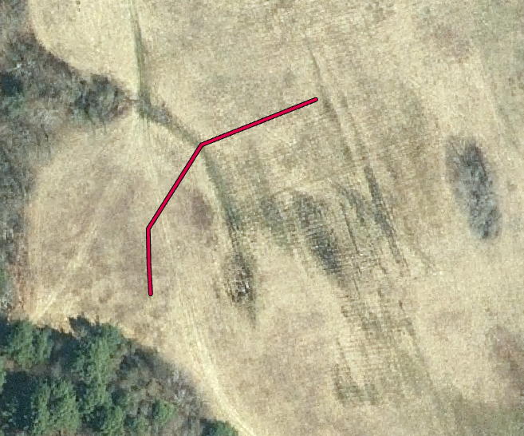
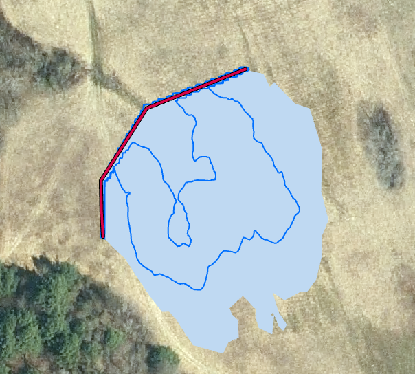
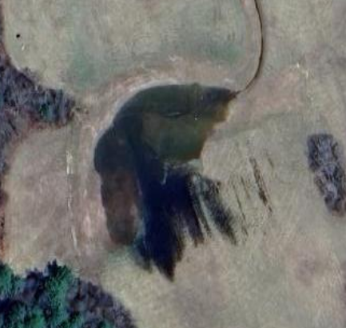
</span>

Example above shows a berm on a shallowly sloped hill, the GIS analysis of the backwatered area along with 1' depth contours, and aerials of the as-built conditions of the berm.

### 2. Dam Removal

Remove a dam from a DEM. Takes a ponded area and a proposed stream line through the area, calculates the estimated thalweg elevations through the ponded area and linearly interpolates the walls of the valley to the thalway to produce a DEM with the ponded area removed.

Eventually this tool should support other valley types such as U-shaped glaciated valleys and flat floodplain creation.

<span>


</span>

Example above shows the tool removing a dam and pond from a digital elevation model (DEM) and estimating the elevations which existed before.

This tool can be used to estimate storage capacity of a dammed area using a DEM.

### 3. Model Potential Wetlands

This tool uses a DEM with a slope cutoff threshold, hydrologic soil group, land use data, topographic wetness index (optional), and existing mapped wetlands (optional) to create a shapefile of potential wetland locations.

<span>
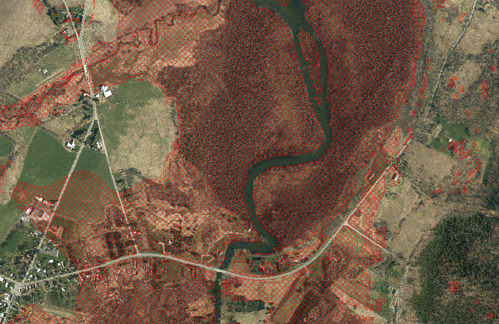
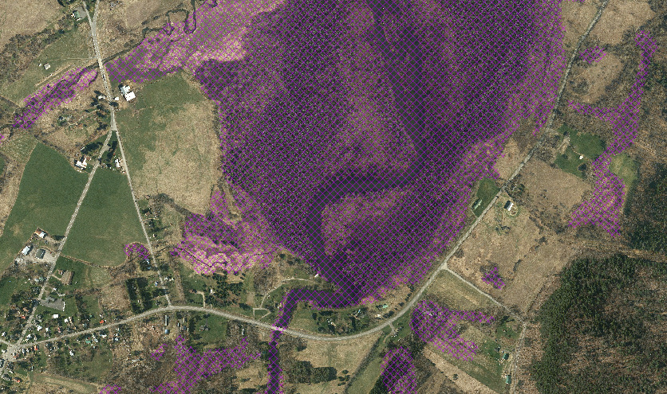
</span>

Exmaple showing modeled potential wetlands (without existing wetland exclusion) in red on the left and mapped wetlands (NWI) in purple on the right.

This tool uses the following procedure:
1. Find slopes <= user specified slope threshold
2. Find all user specified hydric soils
3. Extract all user-specified valid land uses
4. Intersect all of these layers
5. Optional: erase all user-specified mapped wetlands or floodlpains from analysis
6. Optional: find mean value of topographic wetness index (TWI) raster in each output polygon and discard those < the user-specified minimum topographic wetness index

This provides a reasonable approximation of wetland soils, hydrology, and valid land use. The output of this analysis can be intersected with known agricultural ditches or other wetland manipulating structures to find potential project areas. Consider using the [USGS Hyper-Resolution Hydrology Dataset](https://www.usgs.gov/data/chesapeake-bay-hyper-resolution-hydrography-database) for mapped ag and road ditches.

## Hydrology

### 1. Stream Centerline Adjuster

Takes a streamline and optimizes each point along it's path to the lowest perpendicular point in a DEM within a search radius.

<span>
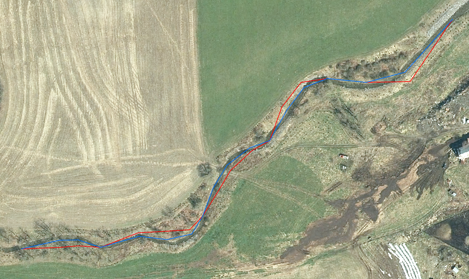
</span>

Red line shows before blue line shows after

Note: this tool can perform poorly on highly sinuous streams and often picks up on side-channels lower than the main channel.

### 2. Stream Elevation Profile

TODO

### 3. Watershed Delineation

Takes a pour point and DEM and delineates the contributing watershed.

<span>


</span>

Before and after showing study area topographic map and the delineated watershed

### 4. Calculate Streamlines

In a given watershed use elevation data to find streamlines for flow accumulations larger than the stream initiation threshold

<span>


</span>

### 5. Sub-Basin Delineation

Find sub-basins in a given watershed based off of a watershed flow-accumulation threshold.

<span>


</span>

Before and after showing the delineation of 4 sub-watersheds based off of the specified flow accumulation threshold.

### 6. Runoff Curve Number

Calculates the runoff curve numbers for a given area based off of land use and hydrologic soil group.

<span>
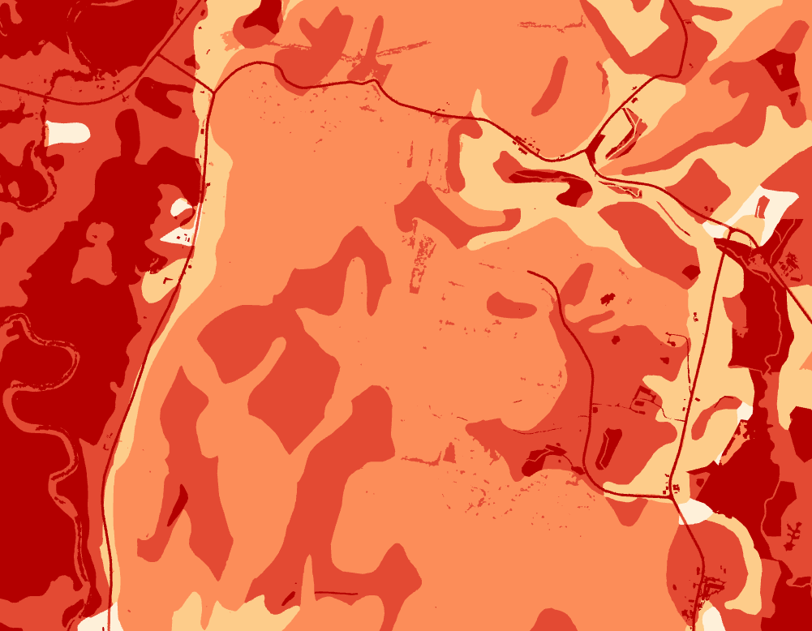
</span>

The example above shows a sample output from this tool, where the darker colors represent a higher band of runoff curve numbers.

Note: in order to use this tool you must have land use / runoff curve number data. We recommend using [Chesapeake Bay Land Use Data](https://www.chesapeakeconservancy.org/projects/cbp-land-use-land-cover-data-project) and modifying the raster to include fields for runoff curve number values for each hydrologic soil groups A,B,C,D as shown:

<span>
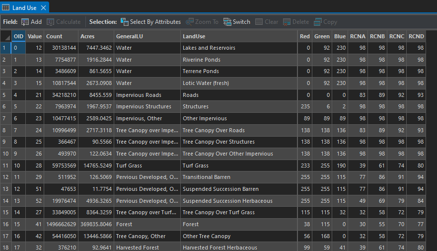
</span>

### 7. EFH-2 Calculation

Perform EFH-2 runoff calculations for a given watershed using DEM and land-use data.

### 8. Topographic Wetness Index (TWI)

Calculates topographic wetness index (TWI) as a model of wetness due to topography and surface flow.

<span>


</span>

Before images showing the study area from aerial and elevation hillshade

<span>


</span>

After images showing output topographic wetness index (TWI) rasters for both low-res and hi-res elevation data. Blue colors represent higher (wetter) TWI values and white colors lower TWI values. You can clearly see drainage channels, as well as how topography impacts wetness.

<span>

</span>

This shows a TWI output with mapped NWI and DEC wetlands. Notice the  significant overlap with the darkest TWI areas.

### 9. Relative Elevation Model (REM)

Create a relative elevation model (REM) or height above nearest drainage (HAND) model in a study area. This allows the user to see elevation normalized features above the stream elevation. This is useful for modeling streambank incision and indentifying geomorphic features.

<span>
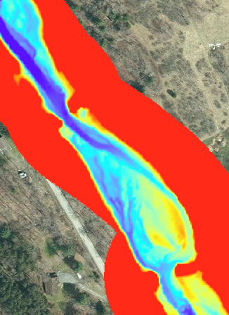
</span>

This example outputs show legacy sediment deposits behind a breached 19th century milldam, as shown by the higher relative streambank incision closest to the milldam.

## Buffer Tools

### 1. Point Plots

Uses Upper Susquehanna Coalition (USC) point plot monitoring methodology and creates the appropriate number of randomized plots for a given riparian forest buffer.

<span>


</span>

This example shows a potential planting area and randomized point plots within it.

### 2. Shrub Clusters

Create shapefile of shrub clusters in a given planting area.

<span>


</span>

This example shows a potential planting area and shrub clusters at a specified size and density within it.

### 3. Riparian Forest Buffer Potential

Create shapefile of potential riparian forest buffer planting areas.

<span>


</span>

This example shows a stream and it's potential riparian forest buffer areas within 200' of stream

This tool uses the following procedure:
1. Clip streamlines to analysis area and create buffer around it
2. Clip land use raster to buffer area
3. Erase non-valid land use areas
4. [Optional] Exclude specified areas
5. Calculate acreage of planting areas
6. Exclude planting areas smaller than specified size

## Raster Tools

Quality of life tools to improve some out of the box geoprocessing tools

### 1. Contour Area

Contour tool with ability to limit analysis to a given area

<span>
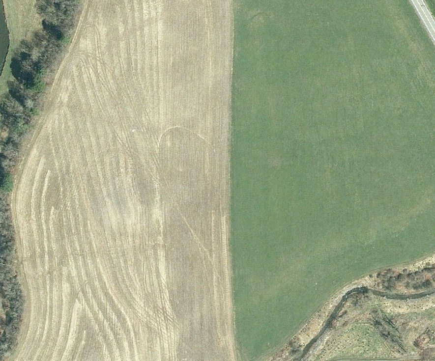
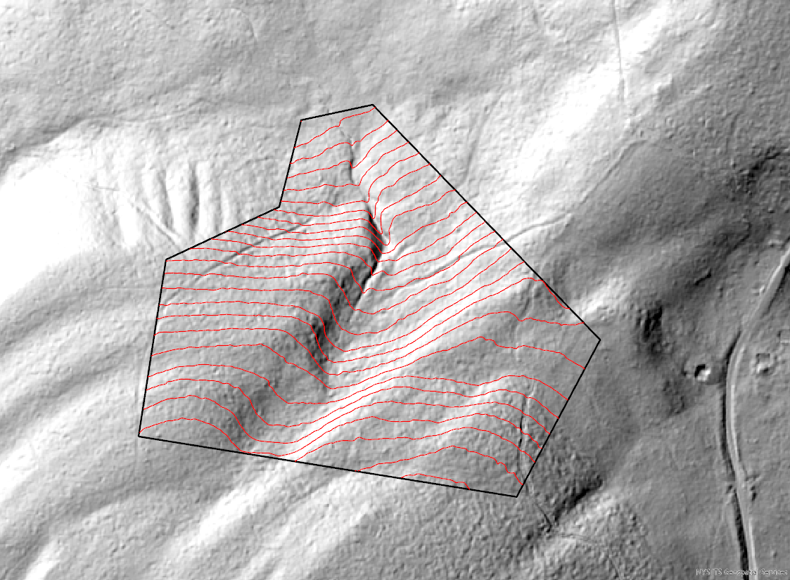
</span>

Example showing a before and after of 1' contours in a sloping field.

### 2. Slope Area

Slope tool with ability to limit analysis to a given area

<span>
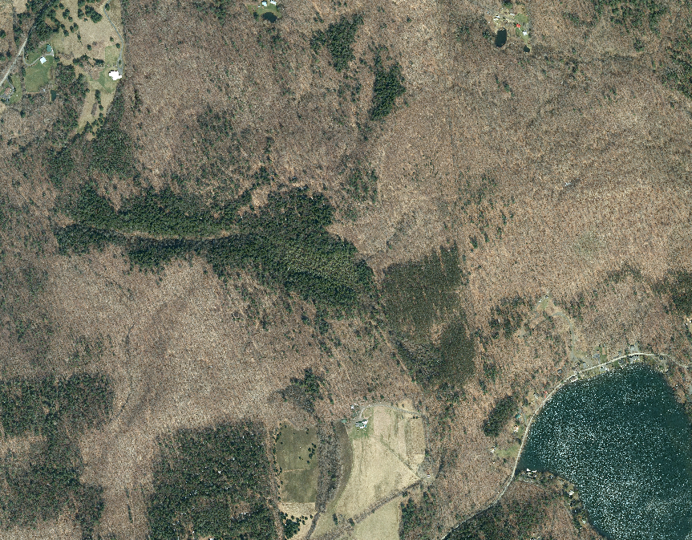
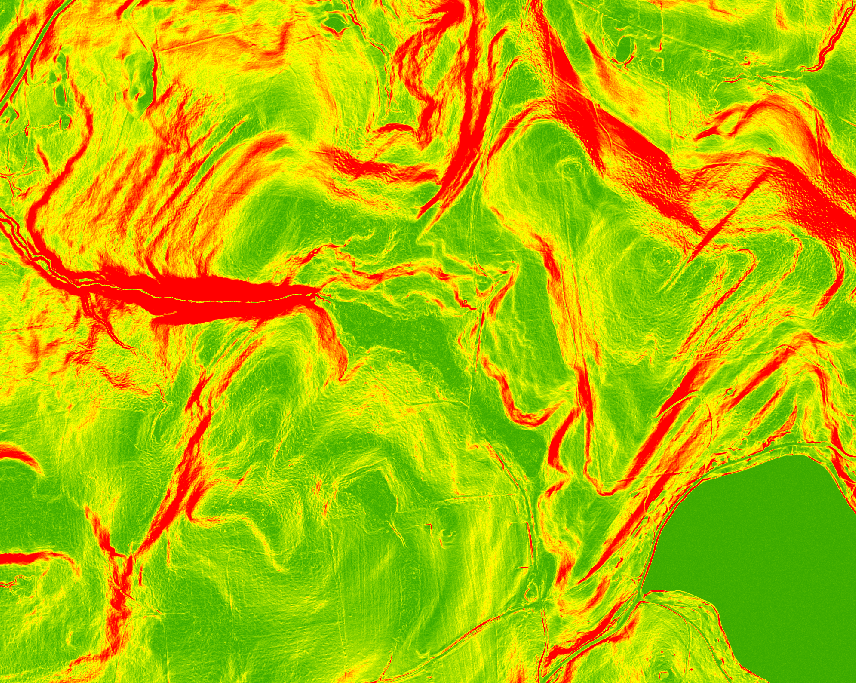
</span>

Example showing before aerials and output slope raster.

### 3. Burn Culverts in DEM

This tool takes a DEM and culvert points shapefile and burns the culverts into the DEM for proper flow direction and accumulation analysis.

<span>
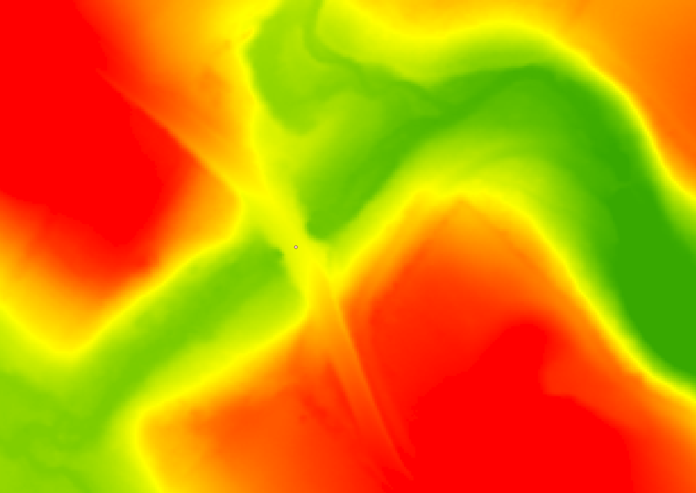
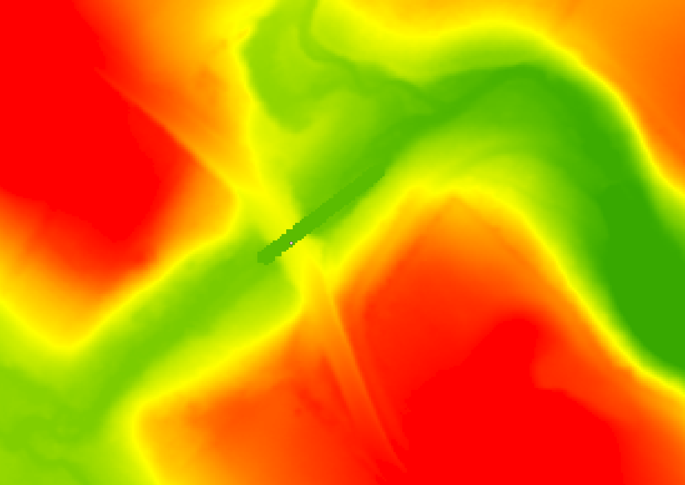
</span>

Example showing before and after DEM with culvert removal.

## Automated Agricultural Assessment

### Notes:
This tool tries to assume nothing about your layer files or folder structure. This means you have to specify layers and fields in those layers to use for processing. This means you need a soils layer with a MUSYM attribute, as well as a parcel layer with parcel ID, municipality, ag district, and a street name/no (123 Apple St) field. You are able to manually specify to the program the name of these fields.

Additionally, you may want to edit the default Soil Group Worksheet template to have your County name or other data.

### 1. Delineate Parcels

Sets up ag assessment project folder and selects all relevant parcels for later analysis.

Once the tool is done, you must manually split each land use (ag, nonag, forest) for each map before proceeding.

<span>


</span>

Output of step one, and the same parcel after manually splitting and saving the three land uses - ag, nonag, and forest.

### 2a. Delineate Agland

After splitting each parcel up into its agricultural, non-agricultural, and forested land areas, use this tool to classify the selected features across all maps as agricultural land.

<span>

</span>

Output of step 2a showing agricultural land delineated.

### 2b. Delineate NonAg

After splitting each parcel up into its agricultural, non-agricultural, and forested land areas, use this tool to classify the selected features across all maps as non-agricultural land.

<span>

</span>

Output of step 2b showing non-agricultural land delineated.

### 2c. Delineate Forest

After splitting each parcel up into its agricultural, non-agricultural, and forested land areas, use this tool to classify the selected features across all maps as forest land.

<span>

</span>

Output of step 2c showing forest land delineated.

### 3. Process

Calculate acreage and soil types across each land use and fill out the soil group worksheet.

Note: you must manually add `MUSYM` and `ACRES` to the tables via the contents pane.

<span>

</span>

Output of step 3 showing the final layout.

### 4. Export Layouts

Export all relevant maps to PDF in the project folder.

## Linear Analysis

Tools to analyze linear features with respect to elevation.

### 1. Local Minimums

Find all of the local elevation minimums along a line. Uses a minimum elevation threshold to ignore small deviations in the underlying DEM data.

<span>
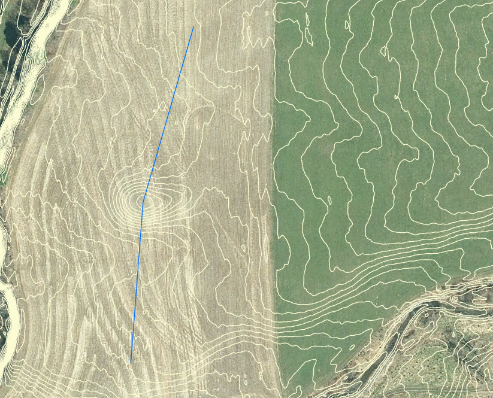
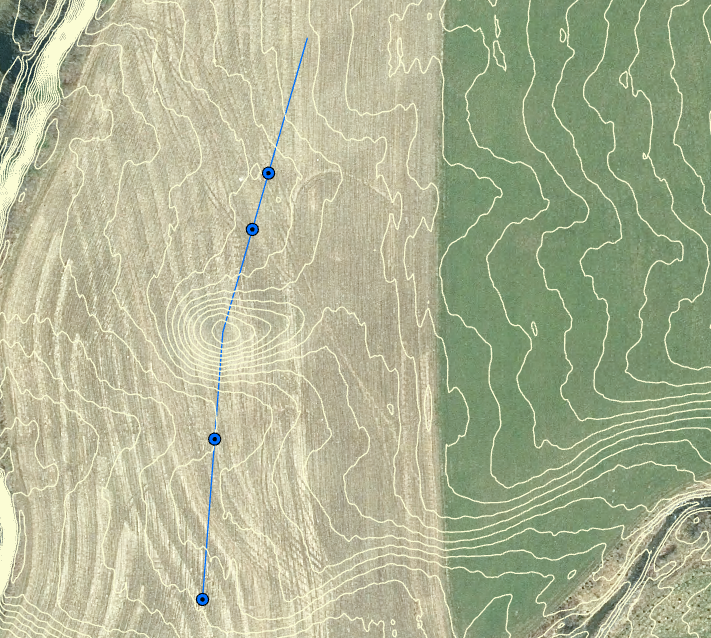
</span>

Example showing a water line in a field and all of the local minimums along it. Lines represent 1' contours, and the local minimum threshold was 2".

## Miscellaneous

### Export Layouts

Quality of life tool to select which layouts to export and to where

### Historical Imagery

Only for in-house use since it depends on a very specific file structure and historical imagery raster structure

### Geocode address tool

Uses [NY GIS Address Geocoder](https://gis.ny.gov/address-geocoder) to take an address and return a point on the map.

# Contributing

Contributions welcome, please open issues for feature requests and bugs, and pull requests for code changes.

# License

Please refer to the [LICENSE](LICENSE) file.
